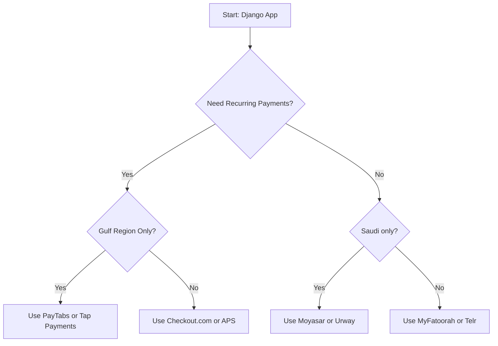

# 💳 Payment Gateway Summary for Django Projects (Saudi & GCC)

This README provides a quick summary of the most suitable payment gateways for Django-based projects targeting the Saudi Arabian and GCC market, especially those that require **recurring payments** (subscriptions).

## 📊 Summary Table

| Payment Gateway         | Subscription Cost            | Transaction Fee                  | Pros                                                                 | Cons                                                  |
|-------------------------|-------------------------------|-----------------------------------|----------------------------------------------------------------------|-------------------------------------------------------|
| **PayTabs**             | Free                          | 2.7% + 1 SAR                      | Supports Mada, STC Pay, Apple Pay, Easy API integration              | Slightly higher transaction fee                      |
| **HyperPay**            | Free (May have setup cost)    | 2.5% + 0.75 SAR (1.75% for Mada)  | Mada, Apple Pay (Recurring), bank partnerships, Smart retry         | STC Pay support unclear, needs manual setup          |
| **Tap Payments**        | Free                          | 2.85% + 0.30 SAR                  | Supports Mada, STC Pay, Apple Pay, Fast activation                   | No official Python SDK                              |
| **Amazon Payment Services** | Free (Negotiable)        | 2.8% – 3.0%                       | Trusted brand, Apple Pay, Mada, STC Pay, Recurring billing           | Complex setup, needs integration with signed requests |
| **Moyasar**             | Free                          | 2.75% + 1 SAR                     | Saudi-based, Mada, STC Pay, Apple Pay, developer-friendly            | Mainly local focus                                   |
| **MyFatoorah**          | Free                          | 2.75% + 1 SAR                     | Wide GCC support, recurring payments, invoice links                  | Limited brand recognition, slower support            |
| **Telr**                | Free (or monthly plans)       | 2.9% + 1 SAR                      | Supports urpay, Mada, recurring billing                              | Higher transaction fees, support inconsistencies     |
| **Checkout.com**        | Negotiable                    | ~3.9% + 0.45 USD                  | Advanced recurring tools, Mada support, global currencies            | Expensive, for large businesses                      |
| **Urway**               | Free                          | ~2.9% + 1 SAR                     | Saudi-based, Mada support, modern dashboard                          | Higher fees, limited technical docs                  |
| **BayanPay**            | Free                          | Not disclosed                     | Saudi licensed, targets B2B/B2G                                      | New platform, limited public info                   |

---

## ⚖️ Recommendations

- **Best for startups in Saudi Arabia:** Moyasar, Tap Payments, MyFatoorah  
- **Best regional coverage (GCC):** PayTabs, Telr, MyFatoorah  
- **Best for enterprise/subscription-heavy systems:** Checkout.com, Amazon Payment Services  
- **Best support for Mada, Apple Pay & STC Pay:** HyperPay, Tap, PayTabs

---

## 🌎 Optional: Flowchart (Mermaid Style)

> Note: Mermaid diagrams only render in platforms that support Mermaid (e.g., GitHub, GitLab, Obsidian, some Markdown preview tools).

---

## ✅ Notes
- All listed gateways support REST APIs, which are easily integrable with Django using `requests` or `httpx`.
- Most offer sandbox environments and tokenization for secure recurring charges.
- Fees are approximate and may vary by usage volume and contract.

---

> For help with implementation or code examples, feel free to ask!
